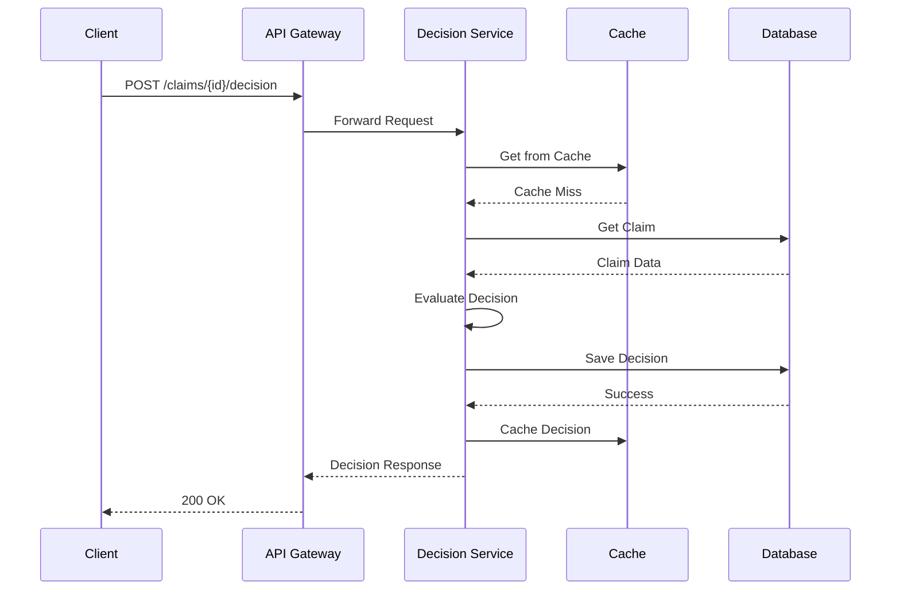

# Sequence Diagrams

This document contains sequence diagrams for critical flows in the Security Deposit Claims Decision Engine.

## 1. Synchronous Decision Request (Happy Path)

```
Client                    API Gateway              Decision Service         Cache (Redis)        Database (PostgreSQL)
  |                            |                            |                      |                      |
  |--POST /claims/{id}/decision->|                            |                      |                      |
  |                            |--Validate Auth------------>|                      |                      |
  |                            |<--Auth OK-------------------|                      |                      |
  |                            |--Check Rate Limit---------->|                      |                      |
  |                            |<--Rate Limit OK-------------|                      |                      |
  |                            |--Forward Request----------->|                      |                      |
  |                            |                            |--Get from Cache----->|                      |
  |                            |                            |<--Cache Miss----------|                      |
  |                            |                            |--Get Claim----------->|                      |
  |                            |                            |                      |--Query DB------------>|
  |                            |                            |                      |<--Claim Data----------|
  |                            |                            |<--Claim Data------------|                      |
  |                            |                            |--Get Documents------->|                      |
  |                            |                            |                      |--Query DB------------>|
  |                            |                            |                      |<--Documents-----------|
  |                            |                            |<--Documents-----------|                      |
  |                            |                            |--Evaluate Decision---|                      |
  |                            |                            |  (Eligibility Engine)  |                      |
  |                            |                            |  (Invoice Parser)     |                      |
  |                            |                            |  (Rule Evaluator)     |                      |
  |                            |                            |--Save Decision------->|                      |
  |                            |                            |                      |--Insert Decision----->|
  |                            |                            |                      |--Insert Audit Log---->|
  |                            |                            |                      |<--Success-------------|
  |                            |                            |<--Decision Saved------|                      |
  |                            |                            |--Cache Decision------>|                      |
  |                            |                            |<--Cached--------------|                      |
  |                            |<--Decision Response---------|                      |                      |
  |<--200 OK (Decision)--------|                            |                      |                      |
```

## 2. Asynchronous Batch Processing

```
Client                    API Gateway              Batch Service            Message Queue (Redis)  Celery Worker         Decision Service
  |                            |                            |                      |                      |                      |
  |--POST /batch/evaluate------>|                            |                      |                      |                      |
  |                            |--Validate Request--------->|                      |                      |                      |
  |                            |<--Valid--------------------|                      |                      |                      |
  |                            |--Forward Request---------->|                      |                      |                      |
  |                            |                            |--Create Batch Job---->|                      |                      |
  |                            |                            |--Enqueue Tasks------->|                      |                      |
  |                            |                            |                      |--Tasks Queued-------->|                      |
  |                            |<--202 Accepted (batch_id)---|                      |                      |                      |
  |<--202 Accepted-------------|                            |                      |                      |                      |
  |                            |                            |                      |                      |                      |
  |                            |                            |                      |<--Dequeue Task--------|                      |
  |                            |                            |                      |                      |--Process Claim------->|
  |                            |                            |                      |                      |  (Decision Engine)    |
  |                            |                            |                      |                      |<--Decision------------|
  |                            |                            |                      |<--Task Complete-------|                      |
  |                            |                            |--Update Batch Status->|                      |                      |
  |                            |                            |                      |                      |                      |
  |                            |                            |--Check if Complete--->|                      |                      |
  |                            |                            |<--All Complete---------|                      |                      |
  |                            |                            |--Send Webhook-------->|                      |                      |
  |                            |                            |                      |                      |                      |
  |<--Webhook Notification-----|                            |                      |                      |                      |
```

## 3. Document Processing Flow

```
Client                    API Gateway              Document Service         S3 (MinIO)            Celery Queue          OCR Worker
  |                            |                            |                      |                      |                      |
  |--POST /documents (upload)-->|                            |                      |                      |                      |
  |                            |--Validate File------------>|                      |                      |                      |
  |                            |<--Valid--------------------|                      |                      |                      |
  |                            |--Forward Upload----------->|                      |                      |                      |
  |                            |                            |--Upload to S3-------->|                      |                      |
  |                            |                            |                      |<--Stored--------------|
  |                            |                            |<--Upload Success------|                      |                      |
  |                            |                            |--Save Metadata------->|                      |                      |
  |                            |                            |--Enqueue OCR Task---->|                      |                      |
  |                            |                            |                      |--Task Queued-------->|                      |
  |                            |<--202 Accepted (doc_id)----|                      |                      |                      |
  |<--202 Accepted-------------|                            |                      |                      |                      |
  |                            |                            |                      |                      |                      |
  |                            |                            |                      |<--Dequeue Task--------|                      |
  |                            |                            |                      |                      |--Get from S3-------->|
  |                            |                            |                      |                      |<--Document-----------|
  |                            |                            |                      |                      |--Tier 1 OCR----------|
  |                            |                            |                      |                      |  (PyPDF2)            |
  |                            |                            |                      |                      |<--Low Confidence-----|
  |                            |                            |                      |                      |--Tier 2 OCR----------|
  |                            |                            |                      |                      |  (Tesseract)         |
  |                            |                            |                      |                      |<--Text Extracted-----|
  |                            |                            |                      |                      |--Classify Document---|
  |                            |                            |                      |                      |<--Classification-----|
  |                            |                            |                      |                      |--Save Results------->|
  |                            |                            |                      |                      |--Update Metadata----->|
  |                            |                            |<--Processing Complete-|                      |                      |
```

## 4. Error Scenario: OCR Failure with Fallback

```
Client                    Document Service         S3                      OCR Worker            Tesseract            Textract (AWS)
  |                            |                      |                      |                      |                      |
  |--POST /documents----------->|                      |                      |                      |                      |
  |                            |--Upload to S3-------->|                      |                      |                      |
  |                            |<--Stored--------------|                      |                      |                      |
  |                            |--Enqueue OCR--------->|                      |                      |                      |
  |                            |                      |<--Task Queued-------->|                      |                      |
  |                            |                      |                      |                      |                      |
  |                            |                      |<--Dequeue Task--------|                      |                      |
  |                            |                      |                      |--Tier 1 OCR---------->|
  |                            |                      |                      |<--No Text------------|
  |                            |                      |                      |--Tier 2 OCR---------->|
  |                            |                      |                      |                      |--Process------------>|
  |                            |                      |                      |                      |<--Error (Timeout)----|
  |                            |                      |                      |<--Tier 2 Failed-------|                      |
  |                            |                      |                      |--Tier 3 OCR (Fallback)|                      |
  |                            |                      |                      |                      |                      |--Process------------>|
  |                            |                      |                      |                      |                      |<--Text Extracted-----|
  |                            |                      |                      |<--Tier 3 Success------|                      |
  |                            |<--Processing Complete-|                      |                      |                      |
```

## 5. Manual Review Workflow

```
System (Decision Engine)  Manual Review Queue      Analyst                Database              Audit Log
  |                            |                      |                      |                      |
  |--Flag for Review---------->|                      |                      |                      |
  |                            |--Create Review Item->|                      |                      |
  |                            |                      |                      |                      |
  |                            |                      |--Get Pending Items-->|                      |                      |
  |                            |                      |                      |<--Review Items--------|
  |                            |                      |<--Review Items--------|                      |                      |
  |                            |                      |                      |                      |
  |                            |                      |--Review Decision----->|                      |                      |
  |                            |                      |--Override Decision--->|                      |                      |
  |                            |                      |                      |--Update Decision---->|
  |                            |                      |                      |--Create Audit Log--->|
  |                            |                      |                      |                      |--Log Override-------->|
  |                            |                      |                      |<--Success-------------|
  |                            |                      |<--Override Complete---|                      |                      |
  |                            |<--Mark Reviewed-------|                      |                      |                      |
```

## 6. Circuit Breaker Scenario

```
Decision Service         External Service (Textract)  Circuit Breaker
  |                            |                            |
  |--Request 1---------------->|                            |
  |                            |<--Error--------------------|
  |<--Error--------------------|                            |--Increment Failure Count->|
  |                            |                            |                            |
  |--Request 2---------------->|                            |
  |                            |<--Error--------------------|
  |<--Error--------------------|                            |--Increment Failure Count->|
  |                            |                            |                            |
  |--Request 3---------------->|                            |
  |                            |<--Error--------------------|
  |<--Error--------------------|                            |--Increment Failure Count->|
  |                            |                            |--Open Circuit------------>|
  |                            |                            |                            |
  |--Request 4---------------->|                            |
  |                            |                            |--Circuit Open------------>|
  |<--503 Service Unavailable--|                            |                            |
  |                            |                            |                            |
  |                            |                            |--Wait 30s---------------->|
  |                            |                            |--Half-Open--------------->|
  |                            |                            |                            |
  |--Request 5 (Test)---------->|                            |
  |                            |<--Success------------------|
  |<--Success------------------|                            |--Close Circuit----------->|
```

## 7. Database Failover Scenario

```
Application                Primary DB                Read Replica 1         Read Replica 2         Monitoring
  |                            |                            |                      |                      |
  |--Write Request------------>|                            |                      |                      |
  |                            |--Process Write------------>|                      |                      |
  |                            |--Replicate---------------->|                      |                      |
  |                            |                            |--Replicate----------->|                      |
  |                            |                            |                      |                      |
  |                            |                            |                      |                      |
  |                            |<--Failure (Primary Down)---|                      |                      |
  |                            |                            |                      |                      |
  |                            |                            |                      |--Detect Failure------>|
  |                            |                            |                      |<--Failover Trigger----|
  |                            |                            |                      |                      |
  |                            |                            |--Promote to Primary-->|                      |                      |
  |                            |                            |                      |                      |
  |--Read Request------------->|                            |                      |                      |
  |                            |                            |<--Route to Replica 1--|                      |
  |                            |                            |<--Response------------|                      |
  |<--Response-----------------|                            |                      |                      |
```

## 8. Rate Limiting Scenario

```
Client 1                Client 2                API Gateway              Rate Limiter (Redis)
  |                      |                            |                            |
  |--Request 1---------->|                            |                            |
  |                      |                            |--Check Rate Limit--------->|
  |                      |                            |<--Allow (1/1000)-----------|
  |                      |                            |--Process Request---------->|
  |<--200 OK-------------|                            |                            |
  |                      |                            |                            |
  |--Request 2---------->|                            |                            |
  |                      |                            |--Check Rate Limit--------->|
  |                      |                            |<--Allow (2/1000)-----------|
  |                      |                            |--Process Request---------->|
  |<--200 OK-------------|                            |                            |
  |                      |                            |                            |
  |                      |--Request 1----------------->|                            |
  |                      |                            |--Check Rate Limit--------->|
  |                      |                            |<--Allow (1/1000)-----------|
  |                      |                            |--Process Request---------->|
  |                      |<--200 OK-------------------|                            |
  |                      |                            |                            |
  |--Request 3 (Burst)--->|                            |                            |
  |                      |                            |--Check Rate Limit--------->|
  |                      |                            |<--Allow (3/1000)-----------|
  |                      |                            |--Process Request---------->|
  |<--200 OK-------------|                            |                            |
  |                      |                            |                            |
  |--Request 4 (Burst)--->|                            |                            |
  |                      |                            |--Check Rate Limit--------->|
  |                      |                            |<--Rate Limit Exceeded---->|
  |<--429 Too Many Req---|                            |                            |
  |                      |                            |                            |
  |                      |                            |--Wait 60s----------------->|
  |                      |                            |<--Reset Counter-----------|
```

## Diagram Tools

These diagrams can be rendered using:
- [Mermaid](https://mermaid.js.org/) - Markdown-based diagram syntax
- [PlantUML](https://plantuml.com/) - Text-based UML diagrams
- [Draw.io](https://app.diagrams.net/) - Visual diagram editor

### Mermaid Example



