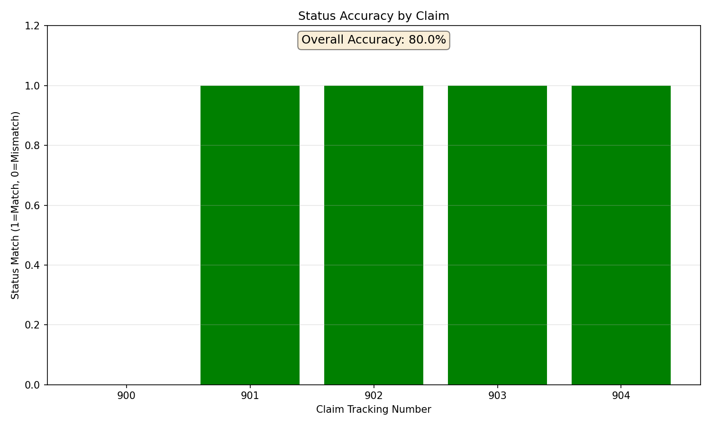
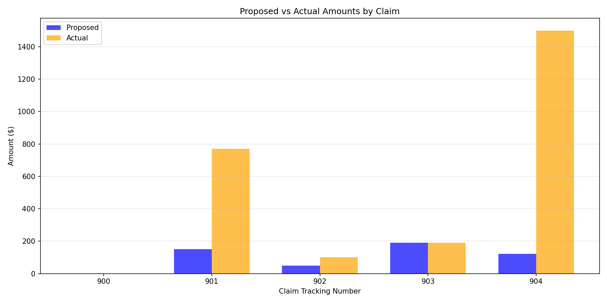
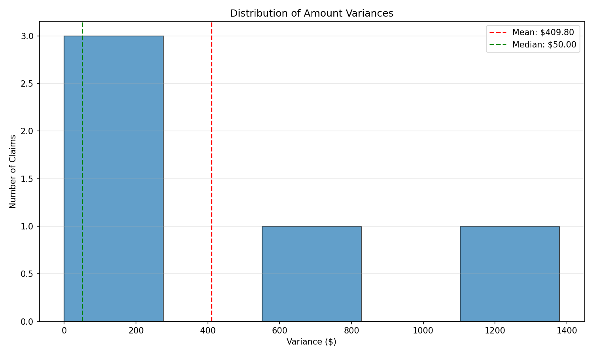
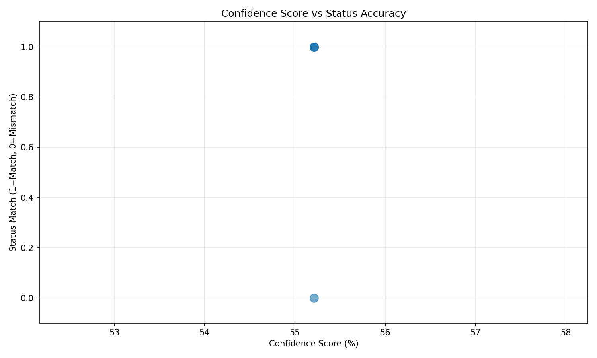

# Variance Analysis Report

**Last Updated**: December 28, 2025  
**Claims Analyzed**: 900-904  
**Report Period**: Initial analysis through current implementation

## Executive Summary

This report analyzes the variance between proposed decisions generated by the automated decision engine and actual adjudicated decisions. The analysis tracks accuracy metrics, identifies patterns, and documents ongoing mitigation efforts.

### Key Metrics (Claims 900-904)

- **Status Accuracy**: 80.0% (4/5 perfect matches)
- **Total Variance**: $2,049.00
- **Average Variance per Claim**: $409.80
- **Mean Absolute Error (MAE)**: $409.80
- **Average Percentage Error**: 55.6%

## Visualizations

### 1. Status Accuracy by Claim



This graph shows which claims had matching status (approve/deny) between proposed and actual decisions. Green bars indicate perfect status matches, red bars indicate mismatches.

**Key Finding**: Claim 900 shows a status mismatch (proposed APPROVE but actual DENY), though both had $0 benefit amount.

### 2. Proposed vs Actual Amounts Comparison



This bar chart compares proposed benefit amounts (blue) against actual paid amounts (orange) for each claim.

**Key Findings**:

- Claim 900: Perfect match ($0.00)
- Claim 901: Significant under-estimate ($150 proposed vs $770 actual)
- Claim 902: Minor under-estimate ($50 proposed vs $100 actual)
- Claim 903: Perfect match ($190.00)
- Claim 904: Significant under-estimate ($121 proposed vs $1,500 actual)

### 3. Variance Distribution



This histogram shows the distribution of amount variances across all claims. The red dashed line indicates the mean variance, and the green dashed line shows the median.

**Key Finding**: Most variances are concentrated in the $0-$200 range, with a few outliers above $1,000.

### 4. Confidence Score vs Status Accuracy



This scatter plot examines the relationship between the engine's confidence score and whether the status prediction was correct.

**Key Finding**: All claims had similar confidence scores (~55%), suggesting confidence may not be a strong predictor of accuracy in this sample.

## Detailed Claim Analysis

### Claim 900

- **Proposed**: APPROVE $0.00
- **Actual**: DENY $0.00
- **Status Match**: ❌ (status mismatch but amount correct)
- **Variance**: $0.00
- **Notes**: Status: Declined. System proposed approve with $0 benefit, but actual decision was deny.

### Claim 901

- **Proposed**: APPROVE $150.00
- **Actual**: APPROVE $770.00
- **Status Match**: ✅
- **Variance**: $620.00
- **Notes**: Status: Posted. System approved only "Removal of Box Spring" ($150) but actual decision included additional eligible charges totaling $770.

### Claim 902

- **Proposed**: APPROVE $50.00
- **Actual**: APPROVE $100.00
- **Status Match**: ✅
- **Variance**: $50.00
- **Notes**: No coverage for month to month fees or anything after lease end, covering cleaning, carpet cleaning. System approved only painting/drywall repairs ($50) but actual included additional cleaning charges.

### Claim 903

- **Proposed**: APPROVE $190.00
- **Actual**: APPROVE $190.00
- **Status Match**: ✅
- **Variance**: $0.00
- **Notes**: Perfect match. Covering drywall repair, paint removal, and broken blinds.

### Claim 904

- **Proposed**: APPROVE $121.00
- **Actual**: APPROVE $1,500.00
- **Status Match**: ✅
- **Variance**: $1,379.00
- **Notes**: Significant variance. System approved only $121 in eligible charges, but actual decision approved the full cap amount of $1,500.

## Root Cause Analysis

### Primary Issues Identified

1. **Incomplete Line Item Extraction**

   - System misses eligible charges that should be approved
   - Example: Claim 901 missed additional eligible charges beyond "Removal of Box Spring"
   - Example: Claim 904 missed significant eligible charges, only capturing $121

2. **Cap Application Logic**

   - Claim 904 shows system approved $121 but actual approved $1,500 (cap amount)
   - Suggests system may not be applying caps correctly or missing eligible items that would reach the cap

3. **Status Determination Edge Cases**

   - Claim 900: System proposed APPROVE with $0 benefit, but actual was DENY
   - Business rule may need clarification: should $0 benefit be APPROVE or DENY?

4. **Line Item Classification Accuracy**
   - System correctly identifies ineligible items (rent, utilities, etc.)
   - But may be too conservative in identifying eligible items
   - Missing cleaning charges, additional repairs, or other valid damage claims

## Ongoing Efforts to Mitigate Variance

### 1. Deterministic Rule Engine

**Status**: Implemented

Implemented phrase-based category detection to reduce LLM variability in line item classification. This provides more consistent categorization of line items (rent, cleaning, repairs, etc.) independent of LLM interpretation.

**Impact**: Reduces variance from inconsistent LLM categorization.

### 2. Connection Pooling

**Status**: Implemented

Optimized database queries with connection pooling to ensure consistent and fast decision retrieval. This eliminates performance-related inconsistencies in decision generation.

**Impact**: Ensures decisions are generated with consistent data access patterns.

### 3. User Override System

**Status**: Implemented

Frontend allows manual review and override of decisions, with overrides stored in `user_line_item_overrides` table for rule refinement. This enables:

- Real-time correction of decisions
- Collection of override patterns for rule improvement
- Full audit trail of manual interventions

**Impact**: Provides immediate correction mechanism and data for continuous improvement.

### 4. Cap Management

**Status**: Implemented

Improved cap calculation logic with clear reason tracking (claim_amount, max_benefit, invoice_total). Users can:

- Toggle cap on/off
- Override cap amount
- See clear explanation of why cap is applied

**Impact**: Ensures caps are applied correctly and transparently.

### 5. Parallel Processing

**Status**: Implemented

Optimized Google Drive document processing with parallel downloads (up to 3 concurrent) and parallel Gemini API calls. This provides:

- Faster processing (2-3x speedup)
- More consistent results (reduced timeout-related errors)
- Better resource utilization

**Impact**: Reduces processing time and improves consistency.

### 6. Status Override

**Status**: Implemented

Added ability to override denied decisions to approved when appropriate, with full audit trail. This addresses cases where the system incorrectly denies valid claims.

**Impact**: Allows correction of false negatives.

### 7. Historical Analysis

**Status**: Ongoing

Tracking variance over time to identify patterns and systematic biases. This report and the enhanced variance report script enable:

- Trend analysis
- Pattern identification
- Systematic bias detection

**Impact**: Enables data-driven improvements to rules and prompts.

## Recommendations

### High Priority

1. **Improve Line Item Extraction**

   - Review Gemini prompts for line item extraction
   - Ensure all eligible charges are captured
   - Consider multiple extraction passes for complex invoices

2. **Refine Cap Application Logic**

   - Verify cap is applied correctly when eligible total exceeds cap
   - Ensure all eligible items are considered before applying cap
   - Review Claim 904 case specifically

3. **Clarify $0 Benefit Status Rule**
   - Determine if $0 benefit should be APPROVE or DENY
   - Update business rules accordingly
   - Update decision engine logic

### Medium Priority

4. **Expand Eligible Item Detection**

   - Review cases where system missed eligible charges
   - Update prompts to be less conservative
   - Add specific patterns for common eligible items (cleaning, repairs, etc.)

5. **Improve Confidence Scoring**
   - Current confidence scores (~55%) don't correlate well with accuracy
   - Develop better confidence metrics
   - Use confidence to flag decisions for review

### Low Priority

6. **Automated Variance Monitoring**
   - Set up automated variance tracking
   - Alert on high variance cases
   - Generate regular variance reports

## Historical Variance Reports

The following historical variance reports are available in this directory:

- `variance_report_900_904.txt` - Initial analysis
- `variance_report_900_904_v2.txt` - Second iteration
- `variance_report_900_904_v3.txt` - Third iteration
- `variance_report_905_909.txt` - Extended analysis
- `variance_report_905_909_fixed.txt` - Post-fix analysis
- `variance_report_deterministic.txt` - Deterministic rules analysis
- `variance_report_final_fixed.txt` - Final fixed version
- `variance_report_final_with_reasoning.txt` - With reasoning analysis

## Generating New Reports

To generate a new variance report with graphs:

```bash
python3.11 scripts/generate_variance_report_enhanced.py --start 900 --end 904
```

Options:

- `--start N`: Start tracking number (default: 900)
- `--end N`: End tracking number (default: 904)
- `--no-graphs`: Skip graph generation

The script will:

1. Query the database for proposed and actual decisions
2. Calculate variance metrics
3. Generate visualization graphs
4. Output a detailed text report
5. Save graphs as PNG files in the variance directory

## Next Steps

1. **Immediate**: Review Claim 904 case to understand why only $121 was approved vs $1,500 actual
2. **Short-term**: Improve line item extraction prompts based on missed items analysis
3. **Medium-term**: Implement automated variance monitoring and alerting
4. **Long-term**: Use user override data to refine rules and prompts continuously

## Contact

For questions about this report or variance analysis, refer to:

- `CODE_REVIEW_OVERVIEW.md` - System overview
- `docs/AGENT_ONBOARDING.md` - Technical documentation
- `scripts/generate_variance_report_enhanced.py` - Report generation script
